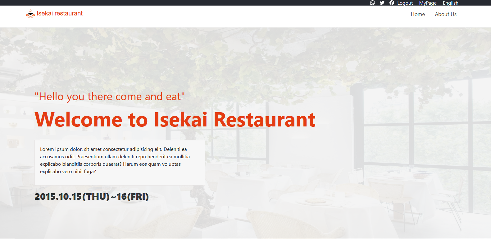

# capstone_1

Welcome to ISekai restaurant

Isekai restaurant. A place where you can eat food from many different cultures with your family or friends. just come and enjoy
## Built With

- Html, CSS and bootstrap
- VS studio as IDE

## Live Demo

[My Live Demo Link](https://m05e5.github.io/capstone_1)

### Prerequisites

- Clone git repository from the main branch

- inside of the cloned repository, run the index.html on a browser

- Or you can just directly access it by clicking here [My Live Demo Link](https://m05e5.github.io/capstone_1)

## Authors

👤 **Moses**

- GitHub: [@m05e5](https://github.com/m05e5)

## 🤝 Contributing

Contributions, issues, and feature requests are welcome!

Feel free to check the [issues page](https://github.com/m05e5/capstone_1/issues/2).

## Acknowledgments

- [Cindy Shin](https://www.behance.net/gallery/29845175/CC-Global-Summit-2015) from who I got my inspiration
- Morning session team who helped me figure out some things

## Show your support

Give a ⭐️ if you like this project!
